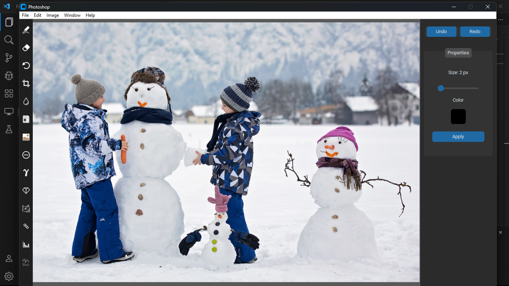

# App chỉnh sửa ảnh

## Hướng dẫn

Required libraries:

- Tkinter, CustomTkinter (Modern Tkinter Gui)
- PIL
- OpenCV

Chạy file *Photoshop.exe* để khởi động app

## Demo
App chỉnh sửa ảnh có các chức năng:
* Upload ảnh

* Vẽ lên ảnh
.png)
* Rotate
.png)
* Blur
.png)
* Grayscale
.png)
* Sepia
.png)
* Negative
.png)
* Gamma Correction
.png)
* Làm nét cạnh
.png)
* Chuyển sang nét vẽ bút (Sketch Effect)
.png)
* Morphology
.png)
* Histogram balance
.png)
* Fourier Transform
.png)
* Save ảnh dưới định dạnh PNG hoặc JPEG

Sản phẩm vẫn còn nhiều tính năng đang trong quá trình phát triển và sẽ được hoàn thiện nếu dự án còn sống